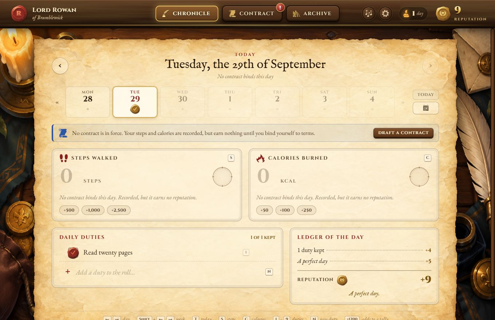

# Fiefdom

A medieval habit ledger. You are a minor noble granted a modest holding; keeping your word — a weekly contract and a roll of daily duties — earns **reputation**, the currency your holding will one day run on. This first part is the ledger itself; the game comes later.



## Getting started (Windows)

1. Install **Node.js 22.12 or newer** from [nodejs.org](https://nodejs.org) (the LTS is fine). Check with `node -v`.
2. Unzip this folder, open a terminal in it, and run:

   ```
   npm install
   npm run dev
   ```

   `npm run dev` opens the app with hot reload — edit anything under `src/renderer` and the window updates instantly.

3. When you want it as a normal program with a desktop shortcut:

   ```
   npm run dist
   ```

   This builds `dist/Fiefdom-Setup-0.1.0.exe`. Run it once to install. The installer isn't code-signed, so Windows may say it's from an unknown publisher — choose **More info → Run anyway**.

| Script              | What it does                                                        |
| ------------------- | ------------------------------------------------------------------- |
| `npm run dev`       | Run the app in development mode with hot reload                     |
| `npm run build`     | Compile to `out/`                                                   |
| `npm start`         | Run the compiled app from `out/`                                    |
| `npm run dist`      | Build the Windows installer into `dist/`                             |
| `npm run dist:dir`  | Build an unpacked app for the current OS (quick packaging check)     |
| `npm test`          | Run the tests (rules, contracts, wagers, saving, Fitbit sync)       |
| `npm run typecheck` | Type-check everything                                               |

## The three pages

**The Chronicle** — one day at a time. Type your steps and the calories you eat into the big tallies (typing replaces the number; `+1200` adds to it; the chips add common amounts). The calorie tally is a budget: it shows how much of the day's limit is left, and turns red when you go over. With [Fitbit connected](#fitbit), the numbers fill in on their own. Below is the roll of **daily duties**: yes/no habits you check off with a wax seal. Step back through past days with the arrows, the week strip or the calendar, and edit them freely. The ledger on the right shows what the day earned and what's still missing for a perfect day.

**The Contract** — each week you draft a contract: daily steps, a **daily calorie limit** (optionally with a minimum, making it a range), the duties you swear to keep, and your weight today. Sealing it takes a press-and-hold on the wax. From then on the terms are shown, never edited. There are two kinds:

- **A common contract** earns reputation for keeping its terms, and risks nothing.
- **A wager** stakes reputation up front — it leaves your purse the moment the wax is set. At the weigh-in the stake is repaid by how the week went: **×3** if Gilded, **×2** if Honored, **×½** if Found Wanting. You can stake anything from 10 up to what you hold.

A contract can only be:

- **kept** — from its last day on, declare your final weight (with an optional note) to close it, or
- **burned** — which destroys the contract *and its progress*: the steps and calories recorded on its days are erased, and so is the reputation they earned. A burned wager's stake is forfeit, and it stays in the Archive as ash so you remember. Checked-off duties are kept.

The calorie term counts only days whose calories are recorded and within the limit — going over (or under the minimum, if you set one) earns no stamp. **Sealing swears in every duty on the roll**: while the contract is open, duties can be checked off and reordered but not added, renamed or struck. The draft lists them, and you can add or strike duties right there before sealing.

Only one contract is open at a time. A new one may start today or up to a week ahead, never overlapping an earlier one. After a weigh-in, the next draft is pre-filled with your last terms and final weight.

**The Archive** — every contract, as a card with a small chart of the week, goals met, weight change and reputation. Search by month, date, year, goal, outcome (`gilded`, `honored`, `wanting`, `lost`, `gained`, `wager`, `burned`) or the words you wrote at the weigh-in; filter by outcome; sort by date, reputation or weight lost. Open a card to see the full contract.

Closed contracts are graded by their daily goals — steps, calories and each sworn duty, on each of the seven days: **Gilded** (all of them), **Honored** (70% or more), **Found Wanting** (fewer).

Contracts sealed before the calorie limit existed keep their original terms: they still count calories *burned*, swore no duties (so they don't lock the roll), and are graded on their 14 goals.

## Reputation

Reputation is never stored — it's recalculated from the ledger (`src/renderer/src/lib/reputation.ts`), so editing a past day simply re-tells history.

| Earned for                                                        | Reputation   |
| ----------------------------------------------------------------- | ------------ |
| Steps goal met (a day under a contract)                           | +10          |
| Within the calorie limit (a day under a contract)                 | +10          |
| Each duty kept                                                    | +4           |
| A perfect day — every goal that applied, every duty               | +5           |
| Streak bonus — per consecutive perfect day before it              | +1 (max +10) |
| Closing a common contract with the final weigh-in                 | +25          |
| A flawless week — every goal, every sworn duty, all seven days    | +50          |
| Sealing a wager                                                   | − the stake  |
| Closing a wager: Gilded / Honored / Found Wanting                 | stake ×3 / ×2 / ×½ |
| Burning a wager                                                   | nothing back |

An unfinished today never breaks your streak; it just hasn't joined it yet.

## Fitbit

Fitbit data now comes through Google's **Health API**, so Fiefdom signs in the same way your `fitbit-game` script does — with a Google Cloud OAuth client of your own. Once connected, Fiefdom reads **steps**, **calories burned in activity** (not what your body burns at rest) and **the calories you log as food** for the last two weeks when it opens, every quarter hour while it's open, and whenever you press the sync button in the top bar.

Typing still works exactly as before, connected or not. A number you type is yours: Fitbit never overwrites it (the tally offers *"Fitbit counts 8,432 — use it"* if you change your mind). An empty food log never counts as a kept calorie limit.

**Setting it up** (once):

1. In [Google Cloud Console](https://console.cloud.google.com), use the project from your fitbit-game script and make sure the **Google Health API** is enabled.
2. Under **Google Auth Platform → Data Access**, add both scopes:
   - `https://www.googleapis.com/auth/googlehealth.activity_and_fitness.readonly` — steps and calories burned in activity (your script already uses this one)
   - `https://www.googleapis.com/auth/googlehealth.nutrition.readonly` — the calories you log as food
3. Under **Clients**, use (or create) a **Desktop app** client and download its JSON — the same kind of `client_secret….json` file your script uses.
4. In Fiefdom, open **Settings → Fitbit**, choose **Load your Google client file…**, then **Connect with Google** and approve in the browser.

While the Google project is in **Testing**, your account must be listed under **Audience → Test users**, and Google ends the connection after seven days. Fiefdom flags it in the top bar; connecting again takes one click. The connection is stored beside the ledger in `health.json`, encrypted by Windows; Fiefdom never sees your Google password, and the page itself never sees the tokens.

## Sound

Fiefdom plays **Innfolk Mirth** as its looping background soundtrack. The recording is bundled with the app and works offline. Every action has an original tavern sound too: soft parchment, wooden clicks, wax presses, quill strokes, brass coins, and mellow dulcimer rewards. The 34 bundled effects were rendered locally with an SFX MCP and tuned using the music's measured pitch and rhythm. [Sound-design notes, local tools, and an audition](docs/sound-design.md).

Open **Settings** (the cog in the top bar) to turn the music and the sound effects on or off and set their volumes. The music-note button, or the **M** key, pauses and resumes the music. The music rests while the window is minimised, then resumes from the same place.

## Keyboard

| Key                          | In the Chronicle               |
| ---------------------------- | ------------------------------ |
| `←` `→` / `Shift`+`←` `→`    | previous / next day, week      |
| `T`                          | today                          |
| `S` / `C`                    | jump to steps / calories       |
| `1`–`9`                      | toggle a duty                  |
| `N`                          | add a duty (when none are sworn) |
| `↑` `↓` in a tally           | ±100 steps or ±10 kcal (Shift ×10) |
| `Ctrl`+`1` / `2` / `3`       | switch pages (anywhere)        |
| `M`                          | pause / resume the music (anywhere) |
| `Ctrl`+`=` / `-` / `0`, `F11` | zoom, fullscreen              |

Drag a duty up or down to reorder it. Removing a duty takes it off the roll from the day you're viewing onward; earlier days keep their record.

## Your data

Everything is saved to one file on your computer:

```
%APPDATA%\Fiefdom\ledger.json
%APPDATA%\Fiefdom\backups\ledger-YYYY-MM-DD.json   (one per day, last 30 kept)
%APPDATA%\Fiefdom\health.json                       (the Fitbit connection, encrypted — only if you connect)
```

Nothing leaves your computer except the requests Fitbit sync makes to Google. Writes are atomic (a crash can't leave a half-written file), and if the ledger is ever damaged the app falls back to the newest good backup. `npm run dev` and the installed app share the same ledger. To experiment without touching it, point the app at another folder (PowerShell):

```
$env:FIEFDOM_DATA_DIR = "C:\temp\fiefdom-test"; npm run dev
```

## How it's built

Electron + React 19 + TypeScript, bundled with electron-vite. State lives in a small [zustand](https://github.com/pmndrs/zustand) store — the same store React Three Fiber scenes can read from when the holding itself arrives.

```
src/
  main/            Electron main process: window, IPC, ledger file (atomic writes, backups),
                   and the Google Health client for Fitbit (OAuth with PKCE, daily rollups)
  preload/         The tiny, typed bridge exposed to the page as window.fiefdom
  shared/          Types shared by both sides of the bridge
  renderer/src/
    lib/           Pure rules, no UI: dates, ledger operations, contracts, reputation
    audio/         Sound-effect playback, live hold textures, reverb, and soundtrack player
    assets/audio/  The bundled Innfolk Mirth soundtrack and original tavern SFX
    assets/art/    Painted tavern desk and parchment textures
    state/         Stores: the ledger (+ saving), UI, clock, notices, Fitbit sync
    components/    Wax seals, hold-to-confirm, dialogs, desk props, chronicle/contract/archive parts
    pages/         Chronicle, Contract, Archive
    styles/        Desk, parchment and component styles
tests/             Node test runner tests for the rules, the ledger file and Fitbit sync (against a fake Google)
```

The rules in `lib/` are plain functions that take a ledger and return a new one, so the game can reuse them as they are. When reputation becomes spendable, record purchases as their own entries and subtract them from `computeReputation(...).total`.

## Troubleshooting

**`Error: Electron uninstall` when running `npm run dev`.** After `npm install` fetches the packages, Electron runs a second step that downloads the Electron app itself; that step didn't finish. Make sure `node -v` shows v22.12 or newer, then run this in the project folder:

```
node node_modules/electron/install.js
```

If it still fails, it prints the reason (for example a proxy or antivirus blocking the download). Also check that `npm config get ignore-scripts` says `false`.

## Credits

Desk and parchment artwork generated for Fiefdom with the built-in image generation tool. Asset paths and full prompts are recorded in [the art notes](docs/art-assets.md).

Font: Almendra in regular, bold and italic styles (SIL Open Font License), bundled with the app so it works offline. Background music: **Innfolk Mirth**, supplied by the user. Original sound effects rendered with [sfx-api](https://github.com/gteuscher/sfx-api); live hold textures use the Web Audio API. Illustrated top-bar timber is an original SVG. Icons from [game-icons.net](https://game-icons.net) by their authors, under [CC BY 3.0](https://creativecommons.org/licenses/by/3.0/), via react-icons.
