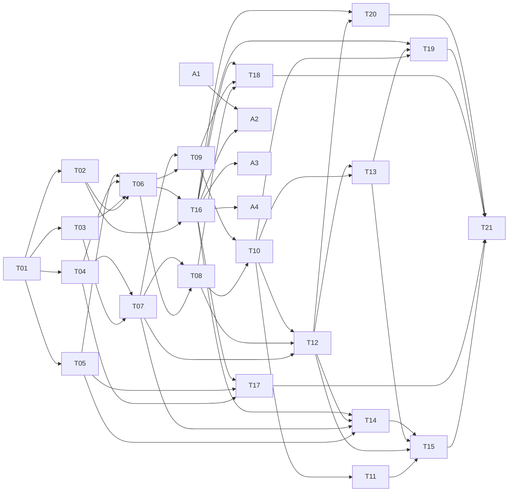

# Fiefdom game build: task breakdown

The campaign layer in the design book is split into **21 AI tasks across 6 phases**, plus **4 asset tasks the owner does last**. T01 runs alone. After that, up to four tasks can run in parallel; the [waves](#waves) table shows which.

| File | What it is |
| --- | --- |
| [design-book-v2.md](design-book-v2.md) | The game spec: a snapshot of the v2 design book (Claude Doc), exported 2026-10-05 |
| [decisions.md](decisions.md) | The owner's decisions, planning assumptions and corrected examples. **Overrides the book.** |
| [tasks/](tasks/) | One file per task: goal, what to read, scope, files, verification |

## Before handing out the first task

1. Commit or stash any work in progress, so every task branches from a clean commit. (At planning time, `src/main/health.ts` and two test files had uncommitted changes.)
2. Skim [decisions.md](decisions.md). Every **A-** line is a default you can still change. Changing one after the affected task has merged costs a rework.
3. Run `npm install`, `npm test` and `npm run typecheck` once, and confirm they pass on `main`.

## How to hand a task to an AI

Give the agent this prompt, with the task ID filled in:

> You are implementing task **Txx** of the Fiefdom game build. Read, in order: `CLAUDE.md`, `docs/game/README.md` (especially Conventions), `docs/game/decisions.md`, and `docs/game/tasks/Txx-*.md`. Then read the sections of `docs/game/design-book-v2.md` that the task lists. Work on a branch named `task/txx-<short-name>`. Meet every item under **Verification**, and show me the command output that proves it. Finally, set the task's row in the status table of `docs/game/README.md` to `done` and add your hand-off notes to the bottom of the task file.

Accept a task only when every verification box is ticked with evidence (test names and their output, or screenshots for screens).

## Conventions (every task)

1. **Source of truth.** Use the design book, overridden by `decisions.md`. Never edit `design-book-v2.md`. If you find a gap, add an entry under "Raised by agents" in `decisions.md` instead of guessing silently.
2. **Pure game logic.** All rules live in pure, deterministic TypeScript under `src/renderer/src/lib/game/`. No React, no DOM, no Electron, no file I/O there. `tsconfig.node.json` already includes `src/renderer/src/lib/**`, so tests and the simulator can import these modules in Node.
3. **Every number lives in `lib/game/rules.ts`** (global tuning) or in the codex JSON (per-entry content such as an item's cost). Mark guesses with `// TUNE (A-xx)`. `npm run check:game` (built in T01) flags stray numeric literals.
4. **Randomness** only through `lib/game/rng.ts`, as `draw(seed, date, label)`. Never `Math.random`, `Date.now()` or `new Date()` in `lib/game` (only `clock.ts` handles real time, and it receives `now` as a parameter).
5. **Settle once.** Every result is posted as an event and is never recomputed. Running settlement twice on the same inputs must change nothing.
6. **Hidden stays hidden.** The benchmark, rival income, event criteria and (without Spy Network or Spymaster) rival treasuries and armies never reach the screen as numbers. Screens read them through view-model functions that enforce this, and those functions have tests.
7. **No invented story text.** Narrative strings come from the text catalog through `t(id, facts)`. Placeholders state plain facts. People write the final text (task A3).
8. **Art through slots.** Screens draw art only through `<GameArt slot="…">`. It falls back to a placeholder (colored hex, lettered token) until a real file is listed in the manifest. Art never blocks code.
9. **Screens are thin.** Derive what a screen shows in pure view-model functions (`lib/game/view/*.ts`) with unit tests. Components only render.
10. **Tests.** Node's test runner through `tsx`, in `tests/game/*.test.ts`. Name each test after the spec rule it checks, for example `test('Ch 4 worked example pays 80.68 (E-01)')`.
11. **Shared files.** `lib/game/types.ts`, `rules.ts`, `effects.ts` and the phase list in `settle.ts` are touched by many tasks. Add to them; don't reorganize them, so parallel branches merge cleanly.
12. **Definition of done for every task:** `npm run typecheck`, `npm test` and `npm run check:game` (once T01 exists) all pass, and the task's own verification list is complete.

## Module map

| Module (`src/renderer/src/lib/game/`) | Responsibility | Task |
| --- | --- | --- |
| `types.ts` | All game types, starting from Appendix A | T01, extended by all |
| `rules.ts` | The versioned tuning table (Appendix B and the TUNE assumptions) | T01 |
| `rng.ts`, `clock.ts` | Seeded draws; 04:00 campaign days, weeks and time zones | T01 |
| `codex.ts`, `text.ts` | Load and validate `data/codex/*.json` and `data/text/*.json` | T01 |
| `map.ts` | 127 hexes, roads, between-lands, ownership, villages, Dominion | T03 |
| `score.ts`, `contracts.ts`, `economy.ts` | Q, Valor, RC; contracts and pledges; reputation and the purse | T04 |
| `weight.ts` | Trend, target pace, Momentum, Milestones, Grace, the Healer's range | T05 |
| `campaign.ts`, `settle.ts` | Founding; the day-close and week-close settlement engine | T06 |
| `buildings.ts`, `roster.ts`, `effects.ts` | Tiers, castle, Crossings, companies, realm-wide effects | T07 |
| `combat.ts` | Threats, daily battles, the daily assault | T08 |
| `land.ts` | Courtships, trades, fortification, reclaiming | T09 |
| `rivals.ts` | Benchmark income, the weekly rival turn, Respect, fronts, Border Campaigns | T10 |
| `grand.ts` | The Grand Battle state machine | T12 |
| `world.ts` | Coalitions, events, resolving rivals, Ascendancy, the Siege, victory | T13 |
| `armory.ts` | Items, Wings, Elites, Milestone unlocks | T14 |
| `view/*.ts` | View models for screens | T16 to T20 |
| `sim/` (repo root) | Headless simulator | T11, T15 |

## Tasks

| ID | Task | Phase | Depends on | Status |
| --- | --- | --- | --- | --- |
| [T01](tasks/T01-foundations.md) | Foundations: types, rules table, RNG, campaign clock, codex and text data | 1 Foundations | — | done |
| [T02](tasks/T02-persistence-and-ledger.md) | Persistence and ledger additions: campaign.json, weigh-ins, total calories | 1 Foundations | T01 | done |
| [T03](tasks/T03-map-and-dominion.md) | The realm map, ownership and Dominion | 2 Core rules | T01 | done |
| [T04](tasks/T04-contracts-score-purse.md) | Contracts, consistency scores and the purse | 2 Core rules | T01 | done |
| [T05](tasks/T05-weight-systems.md) | Weight: Momentum, Milestones, the Crown's Grace, the Healer's range | 2 Core rules | T01 | todo |
| [T06](tasks/T06-campaign-and-settlement.md) | Campaign founding and the settlement engine | 2 Core rules | T02 T03 T04 T05 | todo |
| [T07](tasks/T07-buildings-roster-effects.md) | Buildings, castle, Crossings, roster and realm effects | 3 The war | T03 T04 | todo |
| [T08](tasks/T08-daily-combat-and-assault.md) | Daily combat and the daily assault | 3 The war | T06 T07 | todo |
| [T09](tasks/T09-influence-trade-fortify.md) | Influence, trade, fortification and reclaiming | 3 The war | T06 T07 | todo |
| [T10](tasks/T10-rivals.md) | Rivals: benchmark economy, weekly turn, Respect, fronts, Border Campaigns | 3 The war | T08 T09 | todo |
| [T11](tasks/T11-simulator-v1.md) | Simulator v1: economy and land (report only) | 4 Big systems | T10 | todo |
| [T12](tasks/T12-grand-battle-engine.md) | Grand Battle engine | 4 Big systems | T07 T08 T10 | todo |
| [T13](tasks/T13-world-and-endgame.md) | The living world: coalitions, events, resolving rivals, Ascendancy, the Siege | 4 Big systems | T10 T12 | todo |
| [T14](tasks/T14-armory-wings-elites.md) | Armory, Wings, Elites and Milestone unlocks (engine and screen) | 4 Big systems | T05 T07 T12 T16 | todo |
| [T15](tasks/T15-simulator-v2.md) | Simulator v2: full campaign targets and tuning report | 4 Big systems | T11 T12 T13 T14 | todo |
| [T16](tasks/T16-app-shell-founding-plumbing.md) | App shell, founding, Herald, Homecoming, art and text plumbing | 5 Screens | T02 T06 | todo |
| [T17](tasks/T17-contract-and-chronicle-screens.md) | Contract and Chronicle screens, Milestones and Grace | 5 Screens | T04 T05 T16 | todo |
| [T18](tasks/T18-realm-screen.md) | Realm screen: hex map, daily orders, buildings, roster | 5 Screens | T08 T09 T16 | todo |
| [T19](tasks/T19-diplomacy-and-endgame-screens.md) | Diplomacy and endgame screens | 5 Screens | T10 T13 T16 | todo |
| [T20](tasks/T20-grand-battle-screen.md) | Grand Battle screen (desktop) | 5 Screens | T12 T16 | todo |
| [T21](tasks/T21-integration-qa-release.md) | Integration QA, guardrail audit and release | 6 Release | T01–T20 | todo |
| [A1](tasks/A1-art-style-sheet.md) | Art direction and style sheet | 7 Assets (owner) | — (any time) | todo |
| [A2](tasks/A2-art-production.md) | Produce and drop in the art | 7 Assets (owner) | T16, A1 | todo |
| [A3](tasks/A3-writing.md) | Write the story text | 7 Assets (owner) | T01, T16 | todo |
| [A4](tasks/A4-audio.md) | Game sound effects (optional) | 7 Assets (owner) | T16 | todo |

## Waves

Tasks in the same wave don't depend on each other, so they can go to different agents at the same time.

| Wave | Run in parallel | Why it waits |
| --- | --- | --- |
| 1 | T01 | Everything uses its types, rules and RNG |
| 2 | T02, T03, T04, T05 | Each needs only T01 |
| 3 | T06, T07 | T06 joins T02 to T05; T07 needs the map and the purse |
| 4 | T08, T09, T16 | Combat and land plug into settlement; the shell needs founding |
| 5 | T10, T17, T18 | Rivals need combat and land; screens need the shell |
| 6 | T11, T12 | The simulator runs before Grand Battles (book build order), but only reports (D-02) |
| 7 | T13, T14, T20 | Need the Grand Battle engine |
| 8 | T15, T19 | Need the world and endgame |
| 9 | T21 | Needs everything |
| 10 | A2, A3, A4 (A1 any time) | Assets go in last, by the owner |

## Spec tests to keep green

The book's "Tests to write first" (Appendix A), as corrected by decisions.md. Each one is owned by the task named.

| # | Test | Owner |
| --- | --- | --- |
| 1 | Ch 4 worked example pays 80.68, pledge returns 115.26 (E-01) | T04 |
| 2 | Healer example: TDEE 2,550, floor 1,550 | T05 |
| 3 | Worked battle: 116.31 full day, 81.29 poor day (E-02) | T08 |
| 4 | Worked exchange: Brute 40.25, Knights 69 (E-03) | T12 |
| 5 | `BI(0.80, 1.7)` = 344.53 | T10 |
| 6 | Target pace 0.80 at 217 lb, 0.72 at 180, 0.68 at 170 | T05 |
| 7 | Map: 127 hexes, 86 claimable, 12 rival-held, 30 villages, adjacency per E-06 | T03 |
| 8 | Milestones 212 … 168, earliest weeks 4 … 31 (E-04) | T05 |
| 9 | Settlement is idempotent; reloading never changes a battle, courtship, rival turn, Border Campaign or event | T06, then extended by T08 to T13 |
| 10 | No loss before week 36; rings 0 to 2 never change owner; Border Campaigns never target a Gate, capital or player hex | T08, T10, T13 |
