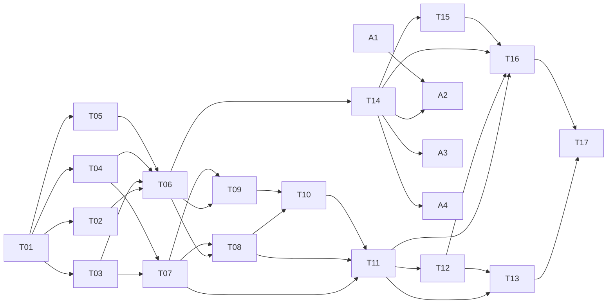

# Fiefdom game build: task breakdown

The campaign layer in the design book is split into **17 AI tasks across 6 phases**, plus **4 asset tasks the owner does last**. T01 to T12 and T14 are done. The remaining seven (T11 to T17) were re-planned on 2026-10-07 as coarser tasks that start from the code as it now stands; at most two run in parallel, and the [waves](#waves) table shows which.

| File | What it is |
| --- | --- |
| [design-book-v2.md](design-book-v2.md) | The game spec: a snapshot of the v2 design book (Claude Doc), exported 2026-10-05 |
| [decisions.md](decisions.md) | The owner's decisions, planning assumptions and corrected examples. **Overrides the book.** |
| [tasks/](tasks/) | One file per task: goal, what to read, what already exists, scope, files, verification |

## Before handing out a task

1. Make sure `main` is clean and every earlier task in its wave has merged, so the task branches from the code its "Start from" section describes.
2. Skim [decisions.md](decisions.md). Every **A-** line is a default you can still change. Changing one after the affected task has merged costs a rework.
3. Run `npm install`, `npm test`, `npm run typecheck` and `npm run check:game` once, and confirm they pass on `main`.

## How to hand a task to an AI

Give the agent this prompt, with the task ID filled in:

> You are implementing task **Txx** of the Fiefdom game build. Read, in order: `CLAUDE.md`, `docs/game/README.md` (especially Conventions), `docs/game/decisions.md`, and `docs/game/tasks/Txx-*.md`. Then read the sections of `docs/game/design-book-v2.md` that the task lists. Work on a branch named `task/txx-<short-name>`. Meet every item under **Verification**, and show me the command output that proves it. Finally, set the task's row in the status table of `docs/game/README.md` to `done` and add your hand-off notes to the bottom of the task file.

Accept a task only when every verification box is ticked with evidence (test names and their output, or screenshots for screens).

## Conventions (every task)

1. **Source of truth.** Use the design book, overridden by `decisions.md`. Never edit `design-book-v2.md`. If you find a gap, add an entry under "Raised by agents" in `decisions.md` instead of guessing silently. A reading may fill a gap the book leaves; it may not contradict what the book says.
2. **Pure game logic.** All rules live in pure, deterministic TypeScript under `src/renderer/src/lib/game/`. No React, no DOM, no Electron, no file I/O there. `tsconfig.node.json` already includes `src/renderer/src/lib/**`, so tests and the simulator can import these modules in Node.
3. **Every number lives in `lib/game/rules.ts`** (global tuning) or in the codex JSON (per-entry content such as an item's cost). Mark guesses with `// TUNE (A-xx)`. `npm run check:game` flags stray numeric literals.
4. **Randomness** only through `lib/game/rng.ts`, as `draw(seed, date, label)`. Never `Math.random`, `Date.now()` or `new Date()` in `lib/game` (only `clock.ts` handles real time, and it receives `now` as a parameter).
5. **Settle once.** Every result is posted as an event and is never recomputed. Running settlement twice on the same inputs must change nothing.
6. **Hidden stays hidden.** The benchmark, rival income, event criteria and (without Spy Network or Spymaster) rival treasuries and armies never reach the screen as numbers. Screens read them through view-model functions that enforce this, and those functions have tests.
7. **No invented story text.** Narrative strings come from the text catalog through `t(id, facts)`. Placeholders state plain facts. People write the final text (task A3).
8. **Art through slots.** Screens draw art only through `<GameArt slot="…">`. It falls back to a placeholder (colored hex, lettered token) until a real file is listed in the manifest. Art never blocks code.
9. **Screens are thin.** Derive what a screen shows in pure view-model functions (`lib/game/view/*.ts`) with unit tests. Components only render.
10. **Tests.** Node's test runner through `tsx`, in `tests/game/*.test.ts`. Name each test after the spec rule it checks, for example `test('Ch 4 worked example pays 80.68 (E-01)')`. Shared builders are in `tests/game/support/` (`realm(seed, ledger)`, `near`, the war and rival-sim helpers) and `tests/game/fixtures/ledgers.ts`.
11. **Shared files.** `lib/game/types.ts`, `rules.ts`, `effects.ts` and the phase list in `settle.ts` are touched by many tasks. Add to them; don't reorganize them, so parallel branches merge cleanly.
12. **Reuse before you write.** The id lists (`RIVAL_IDS`, `BUILDING_IDS`, `LANDS`, `FRONT_IDS`, `FOES`, …) live in `types.ts`; hex queries (`hexIndex`, `touches`, `borderHexesOf`, `nearestTo`, `rivalOfRoad`) in `map.ts`; state helpers (`openDayOf`, `hexOf`, `replaceHex`, `patchRival`, `adjustRespect`, `inCoalition`, `coalitionPartners`, `toPlayer`, `toRival`, `EventBuffer`) in `state.ts`. A second copy of any of them is a review failure.
13. **Settlement hooks don't persist.** `ctx.hooks` lives for one `settle` call and is never saved. Anything that must reach a later day (a battle to fight, Respect to add) goes into the campaign state in the phase that produces it.
14. **Definition of done for every task:** `npm run typecheck`, `npm test` and `npm run check:game` all pass, and the task's own verification list is complete.

## Module map

| Module (`src/renderer/src/lib/game/`) | Responsibility | Task |
| --- | --- | --- |
| `types.ts` | All game types, starting from Appendix A, and the id lists they come from | T01, extended by all |
| `rules.ts` | The versioned tuning table (Appendix B and the TUNE assumptions) | T01 |
| `rng.ts`, `clock.ts` | Seeded draws; 04:00 campaign days, weeks and time zones | T01 |
| `codex.ts`, `text.ts` | Load and validate `data/codex/*.json` and `data/text/*.json` | T01 |
| `errors.ts` | `CampaignError`, a refusal the store shows as a notice | T02 |
| `map.ts` | 127 hexes, roads, between-lands, ownership, villages, Dominion, hex queries | T03 |
| `score.ts`, `contracts.ts`, `economy.ts` | Q, Valor, RC; contracts and pledges; reputation and the purse | T04 |
| `weight.ts` | Trend, target pace, Momentum, Milestones, Grace, the Healer's range | T05 |
| `campaign.ts`, `settle.ts`, `ledgerDays.ts` | Founding; the day-close and week-close settlement engine; reading ledger days into snapshots | T06 |
| `buildings.ts`, `roster.ts`, `effects.ts` | Tiers, castle, Crossings, companies, realm-wide effects | T07 |
| `combat.ts` | Threats, daily battles, the daily assault | T08 |
| `land.ts` | Courtships, trades, fortification, reclaiming | T09 |
| `rivals.ts` | Benchmark income, the weekly rival turn, Respect, fronts, Border Campaigns | T10 |
| `state.ts` | Small shared helpers for reading and changing the campaign state | quality pass, 2026-10-07 |
| `grand.ts`, `grand/field.ts`, `grand/hosts.ts`, `armory.ts` | Grand Battle triggers, the queue, the battle API and outcomes; the round engine and the one battle-effect interpreter; enemy hosts; items, Wings, Elites, trophies, Milestone unlocks | T11 |
| `world.ts`, `world/events.ts` | Resolving rivals, Accords, coalitions, Ascendancy, the Siege, victory, the Chronicle record; the event deck and its effects | T12 |
| `contractActions.ts` | The player's contract actions on the whole campaign: seal, withdraw, Respite, revise the Charter | T14 |
| `view/*.ts` | View models for screens: `shell.ts`, `contract.ts`, `chronicle.ts` (T14); the war table and the big moments (T15, T16) | T14 to T16 |
| `sim/` (repo root) | Headless simulator and tuning report | T13 |

## Tasks

| ID | Task | Phase | Depends on | Status |
| --- | --- | --- | --- | --- |
| [T01](tasks/T01-foundations.md) | Foundations: types, rules table, RNG, campaign clock, codex and text data | 1 Foundations | — | done |
| [T02](tasks/T02-persistence-and-ledger.md) | Persistence and ledger additions: campaign.json, weigh-ins, total calories | 1 Foundations | T01 | done |
| [T03](tasks/T03-map-and-dominion.md) | The realm map, ownership and Dominion | 2 Core rules | T01 | done |
| [T04](tasks/T04-contracts-score-purse.md) | Contracts, consistency scores and the purse | 2 Core rules | T01 | done |
| [T05](tasks/T05-weight-systems.md) | Weight: Momentum, Milestones, the Crown's Grace, the Healer's range | 2 Core rules | T01 | done |
| [T06](tasks/T06-campaign-and-settlement.md) | Campaign founding and the settlement engine | 2 Core rules | T02 T03 T04 T05 | done |
| [T07](tasks/T07-buildings-roster-effects.md) | Buildings, castle, Crossings, roster and realm effects | 3 The war | T03 T04 | done |
| [T08](tasks/T08-daily-combat-and-assault.md) | Daily combat and the daily assault | 3 The war | T06 T07 | done |
| [T09](tasks/T09-influence-trade-fortify.md) | Influence, trade, fortification and reclaiming | 3 The war | T06 T07 | done |
| [T10](tasks/T10-rivals.md) | Rivals: benchmark economy, weekly turn, Respect, fronts, Border Campaigns | 3 The war | T08 T09 | done |
| [T11](tasks/T11-grand-battles-and-armory.md) | Grand Battles and the Armory (engine) | 4 Big systems | T07 T08 T10 | done |
| [T12](tasks/T12-world-and-endgame.md) | The living world and the endgame: coalitions, events, resolving rivals, Ascendancy, the Siege, victory | 4 Big systems | T11 | done |
| [T13](tasks/T13-simulator.md) | The simulator and the tuning report (report only) | 4 Big systems | T11 T12 | todo |
| [T14](tasks/T14-campaign-in-the-app.md) | The campaign in the app: shell, founding, Herald, plumbing, Contract and Chronicle | 5 Screens | T06 | done |
| [T15](tasks/T15-war-table-screens.md) | The war table: Realm and Diplomacy screens | 5 Screens | T14 | todo |
| [T16](tasks/T16-battle-armory-endgame-screens.md) | Battle, Armory and endgame screens | 5 Screens | T11 T12 T14 T15 | todo |
| [T17](tasks/T17-integration-qa-release.md) | Integration QA, guardrail audit and release | 6 Release | T11–T16 | todo |
| [A1](tasks/A1-art-style-sheet.md) | Art direction and style sheet | 7 Assets (owner) | — (any time) | todo |
| [A2](tasks/A2-art-production.md) | Produce and drop in the art | 7 Assets (owner) | T14, A1 | todo |
| [A3](tasks/A3-writing.md) | Write the story text | 7 Assets (owner) | T01, T14 | todo |
| [A4](tasks/A4-audio.md) | Game sound effects (optional) | 7 Assets (owner) | T14 | todo |

### Old task numbers

The hand-off notes of T01 to T10 and the "Raised by agents" entries in `decisions.md` name later work by the numbers of the earlier, finer plan. They map to the current tasks like this:

| Old task | Now in |
| --- | --- |
| T11 Simulator v1, T15 Simulator v2 | T13 (merged: under D-02 an early economy-only run blocks nothing) |
| T12 Grand Battle engine | T11 |
| T13 The living world and the endgame | T12 |
| T14 Armory, Wings, Elites and Milestone unlocks | T11 (engine) and T16 (the Armory page) |
| T16 App shell and plumbing, T17 Contract and Chronicle screens | T14 |
| T18 Realm screen | T15 |
| T19 Diplomacy and endgame screens | T15 (rivals, deals, courtships) and T16 (Accords, coalitions, the Ultimatum, the endgame) |
| T20 Grand Battle screen | T16 |
| T21 Integration QA and release | T17 |

## Waves

Tasks in the same wave don't depend on each other, so they can go to different agents at the same time.

| Wave | Run in parallel | Why it waits |
| --- | --- | --- |
| 1 to 5 | T01; T02 to T05; T06, T07; T08, T09; T10 | Done |
| 6 | T11, T14 | Grand Battles need only the finished war; the app shell needs only founding and settlement |
| 7 | T12, T15 | The world needs Grand Battles; the war table needs the shell |
| 8 | T13, T16 | The simulator needs the whole engine; the big-moment screens need T11, T12 and the war table |
| 9 | T17 | Needs everything |
| 10 | A2, A3, A4 (A1 any time) | Assets go in last, by the owner |

## Spec tests to keep green

The book's "Tests to write first" (Appendix A), as corrected by decisions.md. Each one is owned by the task named.

| # | Test | Owner |
| --- | --- | --- |
| 1 | Ch 4 worked example pays 80.68, pledge returns 115.26 (E-01) | T04 |
| 2 | Healer example: TDEE 2,550, floor 1,550 | T05 |
| 3 | Worked battle: 116.31 full day, 81.29 poor day (E-02) | T08 |
| 4 | Worked exchange: Brute 40.25, Knights 69 (E-03) | T11 |
| 5 | `BI(0.80, 1.7)` = 344.53 | T10 |
| 6 | Target pace 0.80 at 217 lb, 0.72 at 180, 0.68 at 170 | T05 |
| 7 | Map: 127 hexes, 86 claimable, 12 rival-held, 30 villages, adjacency per E-06 | T03 |
| 8 | Milestones 212 … 168, earliest weeks 4 … 31 (E-04) | T05 |
| 9 | Settlement is idempotent; reloading never changes a battle, courtship, rival turn, Border Campaign or event | T06, then extended by T08 to T12 |
| 10 | No loss before week 36; rings 0 to 2 never change owner; Border Campaigns never target a Gate, capital or player hex | T08, T10, T12 |

## Quality pass, 2026-10-07

T01 to T10 were reviewed together after T10 merged. The rules and every number are unchanged: all tests pass, and 52-week campaigns for four seeds settle to byte-identical states before and after. One spec deviation was fixed: coalition partners' shared front is now at Peace, as Ch 13 says (A-144 updated). The hand-off notes in T01 to T10 describe the code as it was when each task merged; these names have since moved:

| Was | Now |
| --- | --- |
| Id lists copied into `codex.ts`, `map.ts`, `effects.ts`, `combat.ts`, `land.ts`, `rivals.ts` (`map.ts` exported `BUILDING_IDS`) | One list per id type in `types.ts`, the source of the type itself |
| `rivalOf(building)` in `buildings.ts` | `rivalOfRoad(building)` in `map.ts` |
| `openDayOf`, `toRival` in `land.ts`; `adjustRespect` in `rivals.ts`; private copies of hex, rival, Respect and log helpers in `combat.ts`, `land.ts`, `rivals.ts` and `settle.ts` | `state.ts` |
| `fortificationValue` in `combat.ts`; a private trade price in `land.ts` and another in `rivals.ts` | `fortificationValue` and `tradeValue` in `land.ts` |
| Accord checks in `combat.ts` and `rivals.ts` beside `blocksRaids` / `blocksConquest` | `blocksRaids` and `blocksConquest` include a running Accord |
| `pledgeCap(days, merchantHallTier, balance)`, `pledgeReturn(pledge, Q, merchantHallTier)`, `merchantHallTier` in `SealContext` and `PayContext`, `respiteBankCap` | `pledgeCap(days, capMult, balance)`, `pledgeReturn(pledge, Q, minShare)`, `pledgeCapMult` and `minPledgeReturn` read from `realmEffects`; the Respite cap is `realmEffects().respiteBank` |
| `strengthBand` and `armyBand` each banding | Both call `band()` in `combat.ts` |
| Optional `Campaign.weekStartsOn`, with `weekStartsOnOf` in `settle.ts` and a Monday default in `combat.ts` | Required, set at founding; read `state.campaign.weekStartsOn` |
| An `Emit` type in `combat.ts` and another in `land.ts` | `Emit` in `types.ts` |
| Saving code copied between `state/store.ts` and `state/campaign.ts` | `state/saver.ts` |
